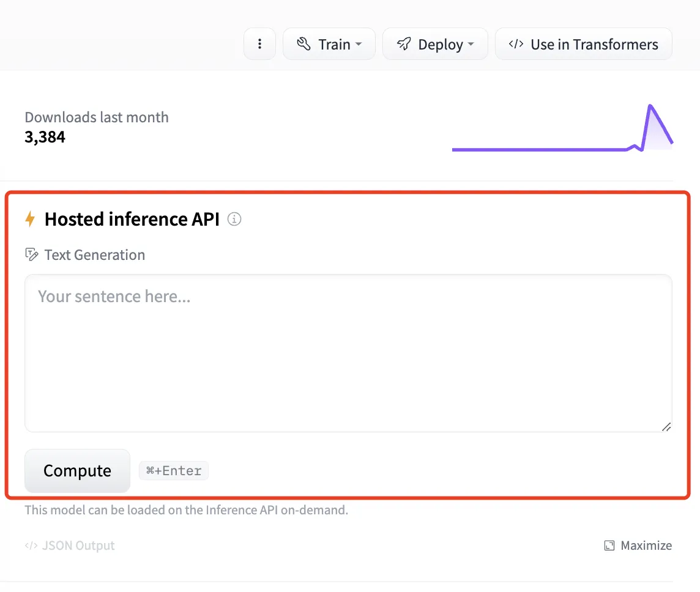
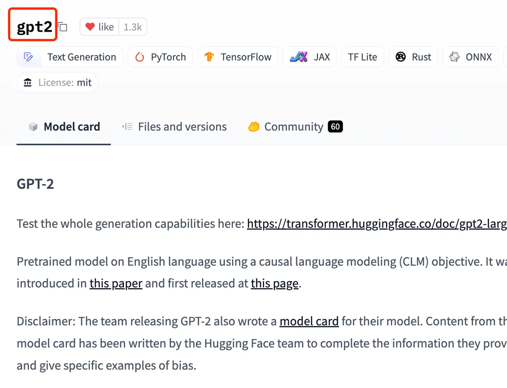
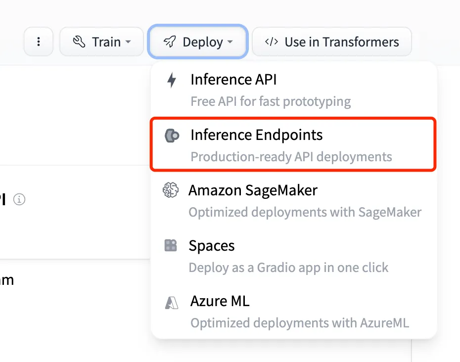

## Overview

Hugging Face is a leading open-source platform and community dedicated to advancing artificial intelligence (AI) and machine learning (ML), particularly in the field of natural language processing (NLP). Founded in 2016, the company initially aimed to create an interactive chatbot but quickly pivoted to focus on providing powerful tools and resources for AI development. Today, it is widely recognized as a central hub for researchers, developers, and enthusiasts to collaborate on machine learning projects.

## Models that access the Hosted Inference API

### 1. Select a model

Hosted inference API is supported only when there is an area containing Hosted inference API on the right side of the model details page. As shown in the figure below:

On the model details page, you can get the name of the model.

## Method 2: Inference Endpoint

### 1. Select the model to deploy

Inference Endpoint is only supported for models with the Inference Endpoints option under the Deploy button on the right side of the model details page. As shown below:

