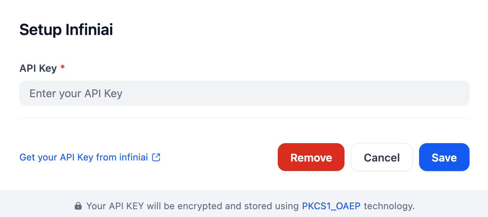

### Overview
InfiniAI(MaaS) provides high-performance APIs for accelerating large model inference, covering multiple modalities such as text, images, and videos. It supports the latest open-source LLM models like DeepSeek, as well as SOTA embedding and reranking models such as Jina/bge. Configuration can be done via model names, API keys, and other parameters.

### Configure
Install the infiniai plugin, then configure it by entering your API Key. Get your API Key from [InfiniAI](https://cloud.infini-ai.com/login?redirect=/genstudio/model?deepsearch) and save.    

### About InfiniAI 
Website | [InfiniAI](https://cloud.infini-ai.com/genstudio/model)

### Contract
yaozhuyu@infini-ai.com

