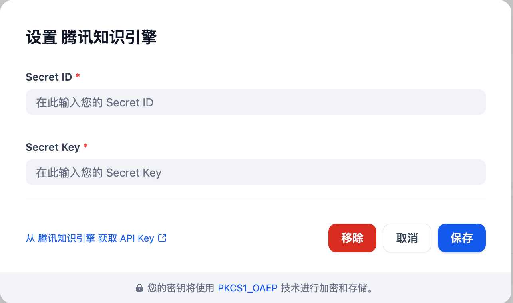

### Overview
LKEAP provides  APIs for large model inference, covering multiple modalities such as text, images, and videos. It supports the latest open-source LLM models like DeepSeek, as well as embedding and reranking models such as hunyuan. Configuration can be done via model names, API keys, and other parameters.

### Configure
Install the LKEAP plugin, then configure it by entering your API Key. Get your API Key from [LKEAP](https://console.cloud.tencent.com/cam/capi) and save.

### About LKEAP 
Website | [LKEAP](https://cloud.tencent.com/document/product/1772)

### Contract
rainsoft@163.com

### Repository
https://github.com/higgs-projects/higgs-lkeap