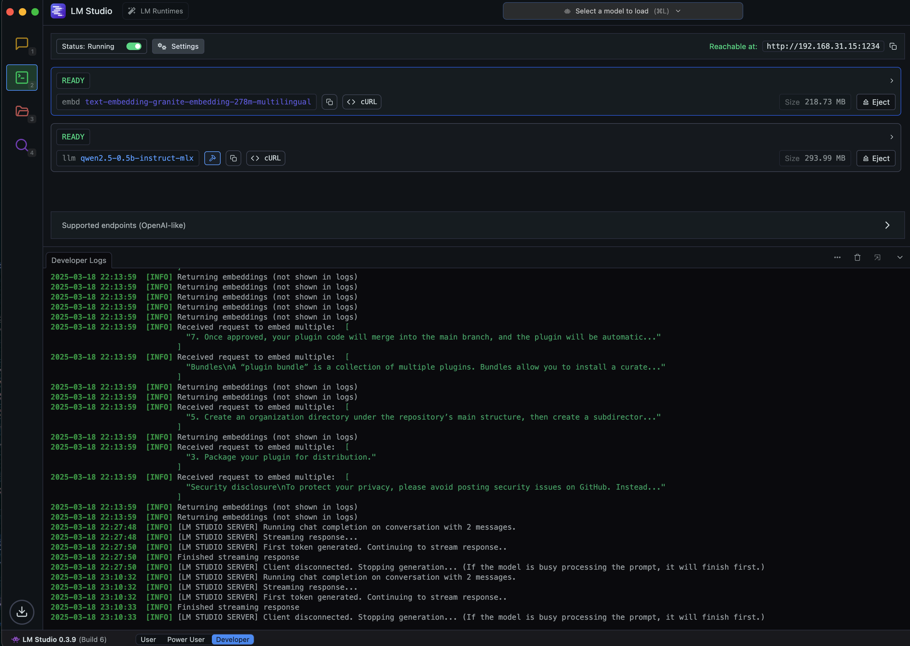

# LM Studio Plugin

**Author:** [Steven Lynn](https://github.com/stvlynn)

**Version:** 0.0.1

**Type:** model

---

## Features

- Support for both Chat and Completion models
- Support text embedding models

## Setup

### LM Studio
1. Install [LM Studio](https://lmstudio.ai/) on your computer
2. Run LM Studio and load a local model

3. Configure LM Studio to serve the model via API (in server mode)
4. Configure the plugin with your LM Studio server URL (default is http://localhost:1234)

## Requirements

- LM Studio running with at least one model loaded
- API server mode enabled in LM Studio

## License

[MIT](./LICENSE)

