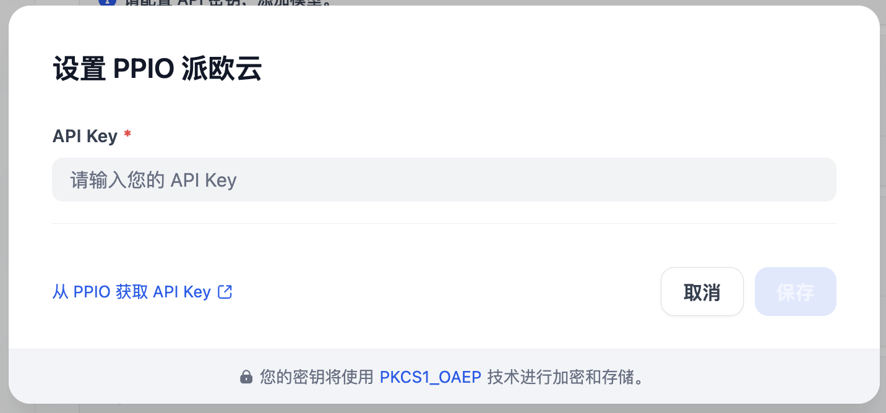
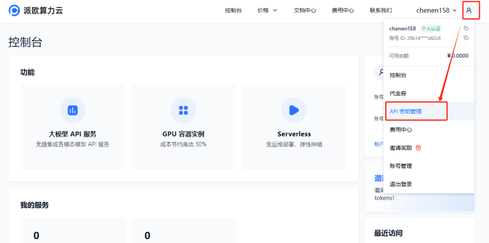
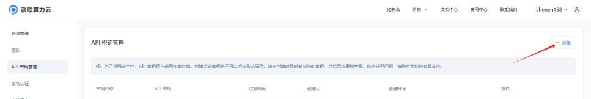

# Introduction

PPIO delivers cutting-edge AI large model inference services, empowering users to deploy and run complex AI tasks with ease. Our platform supports multimodal AI models, including LLMs, image, audio, and video processing, and integrates the latest leading models like DeepSeek, Qwen, Llama, and more. Developers can effortlessly leverage state-of-the-art AI capabilities without requiring deep expertise in machine learning.

# Configuration

1. After installing the plugin, access the [Settings] page to enter your API Key. 

2. [Create a PPIO account.](https://ppio.cn/user/register)
3. Create and save your API key [here](https://ppio.cn/settings/key-management).
   - Click your [User Avatar] → [API Key Management] to access the console.
     
   - Select **[+ Create]** to generate a new API Key. Customize a name, and note that the key **will only be displayed once upon generation** — ensure to copy and save it securely for uninterrupted future use.
     

# Key Features
- **30+ Leading Open-Source Models**: Access a comprehensive suite of top-tier open-source models tailored for diverse tasks and industries.
- **Proprietary Inference Acceleration**: Boost performance with our in-house optimized inference engine, ensuring high throughput and low latency.
- **Developer-Friendly Integration**: Seamlessly integrate AI into your workflows with simple API calls and minimal setup.
- **Cost-Effective AI Solutions**: Enjoy unmatched affordability with flexible pricing models designed for scalability and efficiency.

